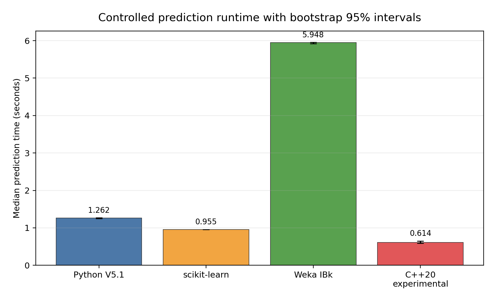

# KNN Credit Default Classification

This university Data Mining project predicts whether a credit-card client will
default in the next month. It compares a manual NumPy KNN classifier,
scikit-learn's KNeighborsClassifier, and Java/Weka's IBk on one fixed
experiment. A verified pure C++20 implementation is included as an experimental
performance candidate.

## Dataset

The project uses the [UCI Default of Credit Card Clients dataset](https://archive.ics.uci.edu/dataset/350/default+of+credit+card+clients):
30,000 records, 23 original predictors, and a binary default target. ID is
excluded from the model.

Download the official spreadsheet and save it as:

```text
data/raw/default.xls
```

## Experiment protocol

- stratified 80/20 train/test split with random seed 42;
- five-fold stratified cross-validation on the training partition;
- odd candidate values from k=1 through k=31;
- mean class-1 F1 as the selection measure, with balanced accuracy and smaller
  k as tie-breakers;
- selected value **k = 19**;
- full one-hot encoding for SEX, EDUCATION, and MARRIAGE;
- median imputation and standard scaling for the remaining features;
- Euclidean distance and uniform voting;
- the same untouched 6,000 test rows for every implementation.

## Implementations

The custom Python package implements exact brute-force KNN with NumPy and
deterministic boundary handling. It does not call a ready-made neighbour
classifier. scikit-learn uses brute-force Euclidean search, uniform weights,
and one worker. The genuine Java project uses Weka 3.8.6 IBk with
LinearNNSearch; Weka distance normalization and internal cross-validation are
disabled to match the prepared experiment.

The optional standard-library-only C++20 candidate implements the same exact
custom prediction semantics and has 6,000/6,000 agreement with accepted Python
V5.1 for classes, positive-neighbour counts, and vote fractions. It remains
experimental and does not replace any implementation in run_all.py. See
[src/cpp_knn/README.md](src/cpp_knn/README.md).

## Project structure

```text
src/common/        shared settings and model helpers
src/data/          loading, validation, summary, and splitting
src/preprocessing/ training-fitted transforms and NPZ/ARFF/C++ export
src/tuning/        cross-validation and k selection
src/custom_knn/    manual NumPy classifier and runner
src/sklearn_knn/   scikit-learn runner
src/evaluation/    metrics, alignment, and comparisons
src/reporting/     standard experiment figures
src/benchmarking/  controlled runtime measurements and report generation
src/cpp_knn/       experimental exact C++20 candidate
src/model_quality/ separate training-only k/metric/voting investigation
weka/              Maven project for genuine Java/Weka IBk
tests/             C++ correctness tests
results/           compact experiment and benchmark evidence
run_all.py         complete three-implementation experiment
```

## Installation

Python 3.10 or later is recommended.

```powershell
python -m venv .venv
.venv\Scripts\activate
python -m pip install -r requirements.txt
```

On macOS or Linux, activate the environment with
source .venv/bin/activate. Weka also requires JDK 11 or later and Maven on
PATH.

## Run the complete experiment

From the repository root:

```bash
python run_all.py --data data/raw/default.xls
```

Use --skip-weka when Java or Maven is unavailable. The standard experiment
writes metrics, agreement, confusion matrices, cross-validation results, and
figures under results/.

## Standalone commands

```bash
python -m src.data --data data/raw/default.xls
python -m src.tuning --data data/raw/default.xls
python -m src.preprocessing --data data/raw/default.xls --selected-parameters results/selected_parameters.json
python -m src.custom_knn
python -m src.sklearn_knn
python -m src.evaluation
python -m src.reporting
mvn -f weka/pom.xml clean package
```

The optional model-quality experiment is deliberately separate from
`run_all.py`. It freezes one winner using training-only CV before a one-time
test evaluation:

```bash
python -m src.model_quality.search --data data/raw/default.xls
python -m src.model_quality.evaluate --data data/raw/default.xls
```

Its artifacts are written only under `results/model_quality/`; see
[src/model_quality/README.md](src/model_quality/README.md) for the leakage guard,
manual selected implementation, and threshold-study boundary.

For the C++ candidate:

```bash
python -m src.cpp_knn.export_data
cmake -S . -B build-cpp-portable -DCMAKE_BUILD_TYPE=Release
cmake --build build-cpp-portable --config Release
ctest --test-dir build-cpp-portable -C Release --output-on-failure
```

## Results

The standard experiment selected k=19.

| Implementation | Accuracy | F1 | Balanced accuracy | ROC-AUC |
|---|---:|---:|---:|---:|
| Custom Python V5.1 | 0.8088 | 0.4391 | 0.6404 | 0.7353 |
| scikit-learn | 0.8092 | 0.4395 | 0.6406 | 0.7354 |
| Weka IBk | 0.8090 | 0.4393 | 0.6405 | 0.7353 |

The controlled benchmark retains 20 randomized, interleaved prediction-only
runs per implementation. The deterministic 95% intervals use 10,000 bootstrap
resamples of all raw timings, including outliers.

| Implementation | Median (s) | Bootstrap 95% CI (s) |
|---|---:|---:|
| Custom Python V5.1 | 1.2617 | 1.2488–1.2688 |
| scikit-learn | 0.9550 | 0.9537–0.9581 |
| Weka IBk | 5.9477 | 5.9236–5.9575 |
| C++20 experimental | 0.6143 | 0.5859–0.6503 |



Trial-index pairing gives a median V5.1/C++ speedup of 2.056×, with C++ faster
in 19 of 20 pairs. The C++ result remains a one-machine experimental finding.
See the
[benchmark report](results/runtime_benchmarks/benchmark_summary.md),
[paired speedups](results/runtime_benchmarks/paired_speedup_summary.csv), and
[figure index](results/runtime_benchmarks/figures/README.md).

Core standard outputs are
[results/metrics_comparison.csv](results/metrics_comparison.csv),
[results/cv_results_summary.csv](results/cv_results_summary.csv), and
[results/prediction_agreement.csv](results/prediction_agreement.csv).

## Tests

```bash
python -m compileall -q src run_all.py
ctest --test-dir build-cpp-portable -C Release --output-on-failure
ctest --test-dir build-cpp-native -C Release --output-on-failure
```

The runtime suite has a separate validator:

```bash
python -m src.benchmarking.build_report_data
python -m src.benchmarking.generate_figures
python -m src.benchmarking.generate_comprehensive_summary
python -m src.benchmarking.validate_runtime_suite
```

Full benchmark methodology, independent-session commands, and the optional
explicit CPU-affinity diagnostic are documented in
[src/benchmarking/README.md](src/benchmarking/README.md).

## Troubleshooting

- If the dataset is missing, confirm data/raw/default.xls exists or pass its
  path with --data.
- If Python reports a missing package, activate the environment and reinstall
  requirements.txt.
- If Weka cannot build, confirm that java -version and mvn -version both work.
- If only Python is available, use python run_all.py --skip-weka.
- Build the C++ input export and executable before running the optional
  four-implementation benchmark suite.

## References

- I-Cheng Yeh, [Default of Credit Card Clients](https://doi.org/10.24432/C55S3H),
  UCI Machine Learning Repository.
- I. Yeh and C. Lien, “The comparisons of data mining techniques for the
  predictive accuracy of probability of default of credit card clients,”
  *Expert Systems with Applications*, 2009,
  [doi:10.1016/j.eswa.2007.12.020](https://doi.org/10.1016/j.eswa.2007.12.020).
- [scikit-learn KNeighborsClassifier documentation](https://scikit-learn.org/1.2/modules/generated/sklearn.neighbors.KNeighborsClassifier.html).
- [Weka IBk documentation](https://weka.sourceforge.io/doc.stable/weka/classifiers/lazy/IBk.html).
