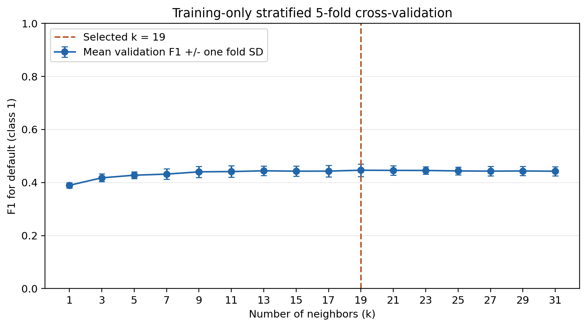
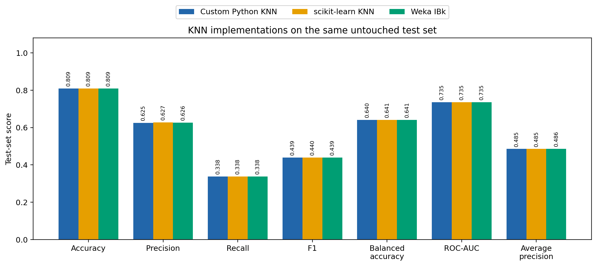
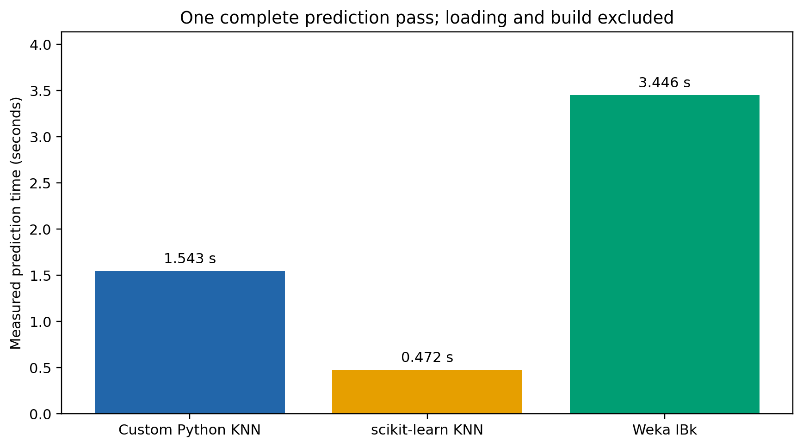

# KNN Credit Default Classification

## 1. Project Overview

This Data Mining project predicts whether a credit-card client will default on
the next month's payment. It uses K-Nearest Neighbours (KNN) as the classifier
and compares three implementations on the same train/test split:

- a manual Python and NumPy implementation;
- scikit-learn's `KNeighborsClassifier`;
- Java/Weka's `IBk` classifier.

## 2. Dataset

The experiment uses the [Default of Credit Card Clients dataset from the UCI
Machine Learning Repository](https://archive.ics.uci.edu/dataset/350/default+of+credit+card+clients).
It contains 30,000 client records and 23 original predictive attributes.

The binary target is:

- `0`: no default in the next month;
- `1`: default in the next month.

The source `ID` identifies a record and is excluded from all model features.
Download the official dataset and save it as:

```text
data/raw/default.xls
```

## 3. Implementations

### Custom Python KNN

The custom classifier manually calculates squared Euclidean distances, selects
the nearest training rows, and performs uniform voting using NumPy. It does not
use a ready-made nearest-neighbour implementation.

### scikit-learn KNN

The scikit-learn comparison uses `KNeighborsClassifier` with brute-force
Euclidean search, uniform weights, and one worker.

### Weka IBk

The Weka comparison is a genuine Java program using Weka 3.8.6 `IBk` and
`LinearNNSearch`. Weka's internal distance normalisation and internal
cross-validation are disabled so it consumes the same transformed features and
selected `k` as the Python implementations.

## 4. Experiment Methodology

- A stratified 80/20 split creates 24,000 training rows and 6,000 test rows.
- The fixed random seed is 42.
- Five-fold stratified cross-validation runs on the training partition only.
- Candidate values are the odd integers from `k=1` through `k=31`.
- Mean F1 for class 1 is the primary selection measure.
- Mean balanced accuracy and then smaller `k` resolve ties.
- The measured cross-validation result selects **k = 19**.
- `SEX`, `EDUCATION`, and `MARRIAGE` receive full one-hot encoding.
- Remaining features receive median imputation and `StandardScaler`.
- Final models use Euclidean distance and uniform voting.
- All three implementations evaluate the same untouched test rows.

## 5. Project Structure

```text
data/raw/          dataset placement instructions
src/common/        experiment settings and shared file/model helpers
src/data/          dataset loading, validation, summary, and splitting
src/preprocessing/ training-fitted transformation and compact NPZ/Weka export
src/tuning/        cross-validation and k selection
src/custom_knn/    manual NumPy KNN and its runner
src/sklearn_knn/   scikit-learn KNN runner
src/evaluation/    metrics, alignment, and implementation comparison
src/reporting/     result chart generation
weka/              Maven project for the Java/Weka implementation
results/           compact measured tables and figures
run_all.py         complete experiment entry point
```

## 6. Installation

Python 3.10 or later is recommended. From the repository root, create and
activate a virtual environment:

```powershell
python -m venv .venv
.venv\Scripts\activate
```

On macOS or Linux, activate it with:

```bash
source .venv/bin/activate
```

Install the Python dependencies:

```bash
python -m pip install -r requirements.txt
```

The Weka implementation also requires JDK 11 or later and Maven available on
`PATH`. Maven downloads the Weka dependencies during its first build.

## 7. Running the Project

Run the complete three-implementation experiment from the repository root:

```bash
python run_all.py --data data/raw/default.xls
```

Use `--skip-weka` when only the two Python implementations are required. The
main stages can also be run separately:

```bash
python -m src.data --data data/raw/default.xls
python -m src.tuning --data data/raw/default.xls
python -m src.preprocessing --data data/raw/default.xls --selected-parameters results/selected_parameters.json
python -m src.custom_knn
python -m src.sklearn_knn
python -m src.evaluation
python -m src.reporting
```

Build the Java project independently with:

```bash
mvn -f weka/pom.xml clean package
```

## 8. Results

Cross-validation selected `k=19`. The following values are from the included
experiment result tables; prediction time is machine-dependent and varies
between runs.

| Implementation | k | Accuracy | Precision | Recall | F1 | Balanced accuracy | ROC-AUC | Average precision | Prediction time (s) |
|---|---:|---:|---:|---:|---:|---:|---:|---:|---:|
| Custom Python KNN | 19 | 0.8088 | 0.6253 | 0.3384 | 0.4391 | 0.6404 | 0.7353 | 0.4853 | 2.480 |
| scikit-learn | 19 | 0.8092 | 0.6271 | 0.3384 | 0.4395 | 0.6406 | 0.7354 | 0.4855 | 0.952 |
| Weka IBk | 19 | 0.8090 | 0.6262 | 0.3384 | 0.4393 | 0.6405 | 0.7353 | 0.4856 | 5.928 |

## Custom KNN Performance Improvement

The original custom implementation used a straightforward feature-by-feature
distance calculation and sorted every training row. The optimised version
precomputes training-vector norms, calculates exact squared Euclidean distances
with NumPy matrix operations, and uses partial top-k selection. Square roots are
only calculated when `kneighbors()` requests actual distances. It remains an
exact brute-force KNN classifier with deterministic tie handling.

The second optimisation pass reuses one distance workspace and partitions one
query row at a time, avoiding a large temporary index matrix. Its exact fallback
also uses partial selection instead of sorting all training rows. Benchmarking
selected batch size 128 because it had the fastest median and used half the
workspace memory of the effectively tied batch size 256.

On the same processed data, the five-run single-thread median decreased from
1.980 seconds for v1 to 1.505 seconds for v2, with a range of 1.496–1.512
seconds. This is 1.32x faster than v1 and 22.11x faster than the original
33.281-second baseline. Predicted classes and class-1 probabilities matched v1
for all 6,000 test rows. The measured comparison is stored in
`results/custom_knn_optimization.csv`.

Detailed values are stored in `results/metrics_comparison.csv`, while confusion
counts and pairwise agreement are in their corresponding compact CSV files.





## 9. Main Source Files

- [`src/custom_knn/classifier.py`](src/custom_knn/classifier.py) contains the complete manual distance, neighbour-selection, voting, and classifier logic.
- [`src/sklearn_knn/runner.py`](src/sklearn_knn/runner.py) configures the scikit-learn comparison.
- [`weka/src/main/java/project/WekaIBkRunner.java`](weka/src/main/java/project/WekaIBkRunner.java)
  configures and runs genuine Weka `IBk`.
- [`src/preprocessing/pipeline.py`](src/preprocessing/pipeline.py) defines the training-fitted preprocessing pipeline.
- [`src/tuning/search.py`](src/tuning/search.py) performs cross-validation and selects `k`.

## 10. References

- I-Cheng Yeh, [Default of Credit Card Clients](https://doi.org/10.24432/C55S3H),
  UCI Machine Learning Repository.
- I. Yeh and C. Lien, "The comparisons of data mining techniques for the predictive accuracy of probability of default of credit card clients," *Expert Systems with Applications*, 2009, [doi:10.1016/j.eswa.2007.12.020](https://doi.org/10.1016/j.eswa.2007.12.020).
- [scikit-learn `KNeighborsClassifier` documentation](https://scikit-learn.org/1.2/modules/generated/sklearn.neighbors.KNeighborsClassifier.html).
- [Weka `IBk` documentation](https://weka.sourceforge.io/doc.stable/weka/classifiers/lazy/IBk.html).

## 11. Troubleshooting

- If the dataset is not found, confirm that `default.xls` exists under
  `data/raw/` or pass its path with `--data`.
- If Python reports a missing module, activate the virtual environment and run
  `python -m pip install -r requirements.txt`.
- If Weka cannot build, confirm that `java -version` and `mvn -version` work.
- If only Python is available, run the experiment with `--skip-weka`.
